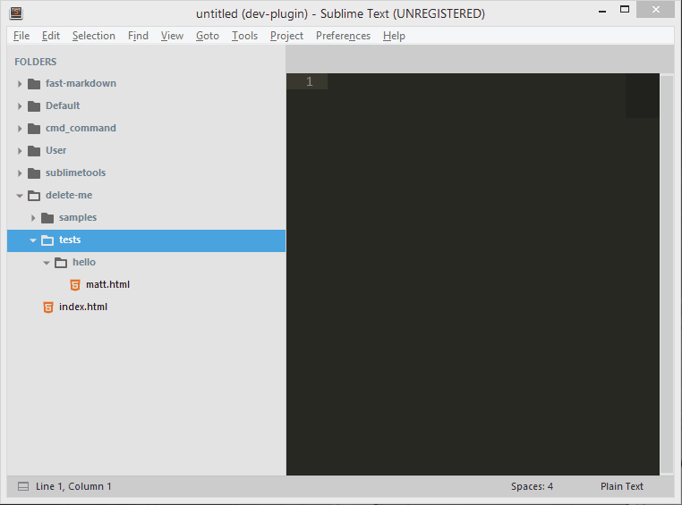

# File Manager

File Manager is a plugin for Sublime Text that is suppose to remplace SideBarEnhancement and AdvancedNewFile.

Why? Because those to plugin basically do the same thing: *They mangage files from sublime text*

So, why would you take File Manager?:

- It uses auto completion in the input to create a file
- Is available from the side bar
- Working on both Sublime Text 2 **and** 3!
- When you select `File: New File`, and you have different folder in the current project, you can pick which folder take as a reference by typing it's position (from 0).

```
FOLDERS
> User
> Default
> fast-markdown
```

If you want to create a file from `fast-markdown`, just type: `2>path/to/my/file`. And the `>` is customizable in your settings! You can pick a space for example!

*It's working with **python** lists, so you can set negative indexes to start from the bottom (try -1 for example)*

If there is no project open, it's going to create from the file that is currently open, and if there is none, then from `~`.



- It uses user friendly path. Even on window, you can do: `~/Documents/a_new_document.txt`. (it's the same as `C:/Users/<user>/Documents/a_new_document.txt`)
- When you forget what folders were in the current directory, you can try to use the auto completion, but there is better! Say you've typed `~/Pictures`, and `Pictures` exists, if you hit `enter`, it will open a quick panel (such as the command palette) with all the folders and files listed, with 2 options added:
    1. Create from here: open a new input panel to create from were you were in the quick panel
    2. Go up (`..`)
- Logs in the status bar where it's creating the file
- It uses templates! You can create a template for each different extension. In the folder `${packages}/User/.FileManager`, create a file `template.<ext>`, and now, every file that you will create using File Manager with the extension `<ext>` will have as a default content the file you've just created's content.


- Open terminal from Sublime Text (which one(s), it's up to you, just have a look in the settings)

##### But, here's the main reason: I personally uses this package, and I hate when things don't go as well as they could. So, you can be sure that this package is 100% optimized for *speed*.

**This plugin is in development. It means that there is probably some bugs. If it's the case, please log an issue [on the github  issue tracker](https://github.com/math2001/FileManager/issues)**

## Docs

The docs are a work in progress, but there's a few useful infos about the `fm_create` command escpecially (the one to create/open file/folder). They're simply on the [github wiki](https://github.com/math2001/FileManager/wiki). **Go have a quick look, you won't regret it** :smile:

## Installation

#### Using package control

Because it is not available on package control for now, you have to add this repo "manually" to your list.

1. open up the command palette (`ctrl+shift+p`), and find `Package Control: Add Repository`. Then enter the URL of this repo: `https://github.com/math2001/FileManager` in the input field.
2. open up the command palette again and find `Package Control: Install Package`, and just search for `FileManager`. (just a normal install)

#### Using the command line

```
cd "%APPDATA%\Roaming\Sublime Text 3\Packages"     # on window
cd ~/Library/Application\ Support/Sublime\ Text\ 3 # on mac
cd ~/.config/sublime-text-3                        # on linux

git clone "https://github.com/math2001/fast-markdown"
```

## For sublime text **2** user

First, I recommended that you swap to Sublime Text **3**, because:

- more and more package are only available on ST3 (have a look at this [stats page](https://packagecontrol.io/stats))
- the development of ST2 has been dropped, in favour for ST3, so it means that all the new cool feature are available only for ST3 users.
- as John said:

> With these latest changes, Sublime Text 3 is almost ready to graduate out of beta, and into a 3.0 version.


So, talking about the cool feature, there is one that has been included in the build 3124:

**The settings opens in a new window, the default ones on the left, and the users one on the right**

As you probably understand, this plugin uses this feature, but ST2 does not have it. So, I created a poly fill for it (a little plugin that makes it available for ST2 users). It's only one file, and all you have to do is paste a code in your console (just like package control) and it will download it for you. [`settings.py`](https://gist.github.com/math2001/6cd5cbb9d2741654c2e994d33c395729#file-settings-py-L27)

Once you've pasted it in the console, go to `Preferences -> Package Settings -> File Manager`, and there you have it!

## How to open the [`README`](https://github.com/math2001/FileManager/blob/master/README.md)

Some of the package add a command in the menus, others in the command palette, or other nowhere. None of those options are really good, escpecially the last one on ST3 because the packages are compressed. But, fortunatly, there is plugin that exists and will **solve this problem for us** (and he has a really cute name, don't you think?): [ReadmePlease](https://packagecontrol.io/packages/ReadmePlease).

### Contributing

There is 2 way of contributing to this packages:

You have an idea that could improve this package:

1. fork it
2. create a new branch called with this format: `my-feature`
3. **add it to the todo.md**
4. If you know how to do it, you have the time and you *want* to do it, then **just do it** (and get the pleasure to remove it from the `todo.md`).
5. Pull Request
